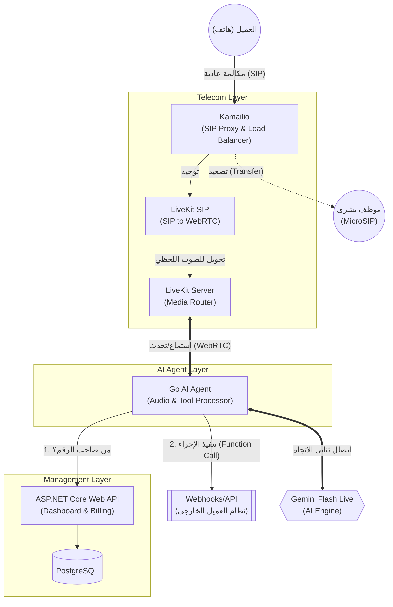

# Omni-Industry Voice AI CPaaS - Master Blueprint 🚀

هذا المستند الشامل (Whitepaper) يمثل المرجع الهندسي والتجاري لبناء منصة اتصالات سحابية بالذكاء الاصطناعي (Voice AI as a Service) بأسس تقنية جاهزة للتوسع لتقييم +100 مليون دولار.

---

## 1. الرؤية العامة (The Vision)
بناء بنية تحتية (Infrastructure) لا تعتمد على الـ STT أو الـ TTS التقليدي، بل تعتمد على النماذج التوليدية الحية (Multimodal Live Models) لإنشاء وكلاء ذكاء اصطناعي (AI Agents) قادرين على إجراء مكالمات هاتفية في الوقت الفعلي (Real-Time) بدون أي تأخير، مع قدرة فائقة على فهم المشاعر وتنفيذ الأوامر.

المنصة مصممة لتكون **(Agnostic)**، أي تدعم قطاعين رئيسيين:
1. **القطاع العادي (Non-SaaS):** مطاعم، عيادات، عقارات، متاجر (بناء على Base Knowledge بسيطة).
2. **قطاع الـ (B2B SaaS):** منصات تقنية، أنظمة ERP، خدمات سحابية (تتطلب تكامل عميق عبر Webhooks للقيام بالدعم الفني المتقدم).

---

## 2. حزمة التكنولوجيا (The Tech Stack)

استخدمنا سياسة **(Polyglot Microservices)** لاختيار أفضل تقنية لكل مهمة:

### أ) طبقة الاتصالات والشبكات (Telecom Edge Layer)
* **Kamailio:** موازن حمل (SIP Load Balancer) جبار لاستقبال وتوزيع آلاف الاتصالات الهاتفية الواردة من مزود الخدمة.
* **Asterisk / LiveKit SIP:** جسر العبور (Bridge) لتحويل مكالمات الـ SIP التقليدية إلى مسارات (WebRTC) حديثة.
* **LiveKit Server:** خادم البث الفعلي (WebRTC SFU) لضمان أعلى نقاء للصوت وأقل نسبة فقدان للبيانات (Ultra-Low Latency).

### ب) طبقة المعالجة اللحظية (Data Plane / AI Engine)
* **Golang (Go):** لغة برمجة عملاء الذكاء الاصطناعي (Go Agents). تمتاز بالـ Goroutines لإدارة عشرات الآلاف من الاتصالات المتزامنة (WebSockets) بخفة وسرعة.
* **Gemini Flash Live API:** محرك الذكاء الاصطناعي (Multimodal Live Model) للقيام بالاستماع والتحدث في نفس اللحظة عبر الـ WebSockets.

### ج) طبقة التحكم والإدارة (Control Plane)
* **ASP.NET Core:** العقل المدبر لإنشاء لوحة التحكم، واجهات الـ API للعملاء، إدارة المشتركين (Tenants)، إعداد الـ Prompts، ومعالجة الفواتير والتسعير.
* **PostgreSQL:** قاعدة البيانات العلائقية الرئيسية.

### د) البنية التحتية والاستضافة (Infrastructure)
* **Kubernetes (K8s):** الأوركسترا التي تدير تشغيل كل هذه التطبيقات وتوسعتها أفقياً (Auto-scaling) لضمان Uptime بنسبة 99.99%.

---

## 3. المعمارية الهندسية (Architecture Diagram)

---

## 4. الميزات التنافسية الخارقة (Killer Features)

1. **انعدام التأخير (Zero-Latency Conversational AI):** استجابة بشرية طبيعية لا تتجاوز 800ms، مع إمكانية مقاطعة البوت أثناء كلامه بكل سلاسة (Natural Interruptions).
2. **استدعاء الدوال الحية (Live Function Calling):** لا يكتفي البوت بالكلام، بل يقوم بأفعال. إذا طلب العميل تأجيل موعد، يقوم الـ Go Agent بإيقاف الصوت للحظة، استدعاء الـ API الخاص بنظام العميل، ثم يخبر العميل: "تم تأجيل موعدك للغد بنجاح".
3. **التسليم البشري بذكاء (Human Handoff via MicroSIP):** إذا غضب المتصل، يقوم البوت فوراً بتحويل المكالمة رقمياً إلى برنامج (MicroSIP) الخاص بالدعم الفني للعميل، مع إرسال إشعار على الشاشة (Screen Pop) يحتوي على ملخص ما قاله العميل للبوت.
4. **أرقام مخصصة (BYOC - Bring Your Own Carrier):** يمكن لأي عميل ربط أرقام الهواتف الخاصة بشركته بالمنصة فوراً عبر SIP Trunk.
5. **الوعي بالسياق (State Awareness):** البوت قادر على جلب سجلات المستخدم قبل بدء المكالمة (مثال: "أرى أن بطاقتك الائتمانية رُفضت بالأمس، هل تتصل بخصوص هذا؟").

---

## 5. تجربة المطورين وحزم الربط (Developer Experience & SDKs)

المنصة لا تعتمد فقط على الـ Webhooks، بل تقدم بيئة تطوير متكاملة (Ecosystem) لجذب المطورين والشركات، من خلال توفير نوعين من حزم التطوير (SDKs):

### أ) حزم الواجهات الأمامية (Frontend WebRTC SDKs)
* **اللغات المدعومة:** React, Vue, Flutter, iOS (Swift), Android (Kotlin).
* **الوظيفة:** تُمكن هذه الحزم عملاء الـ SaaS من دمج زر "اتصل بالذكاء الاصطناعي" داخل تطبيقات الموبايل أو مواقع الويب الخاصة بهم.
* **التقنية المستخدمة:** غلاف (Wrapper) مبني فوق حزم **LiveKit** الأصلية، مما يسمح للمستخدم بفتح المايكروفون والتحدث مع البوت مباشرة عبر الإنترنت دون الحاجة لشبكة الهواتف التقليدية (PSTN).
* **الأمان:** تعتمد على رموز مؤقتة (Temporary Tokens) لا تسمح إلا بإجراء مكالمة واحدة فقط.

### ب) حزم الإدارة الخلفية (Backend Management SDKs)
* **اللغات المدعومة:** Node.js, Python, Java, C#, Go, PHP.
* **الوظيفة:** تُمكن سيرفرات العملاء من التحكم برمجياً في حساباتهم على منصتك (مثال: إنشاء بوت جديد، رفع ملفات معرفة Knowledge Base، أو إطلاق مكالمات صادرة Outbound Calls).
* **التقنية المستخدمة:** الكود المصدري لهذه الحزم يتم إنشاؤه أوتوماتيكياً بالكامل (Write Once, Generate Everywhere) باستخدام أدوات مثل **OpenAPI Generator** أو **Kiota** بناءً على مواصفات الـ API الخاصة بـ ASP.NET Core، مما يوفر آلاف ساعات البرمجة ويضمن توافقية تامة مع كل لغات البرمجة.
* **الأمان:** تتطلب مفتاح أمان سري (Secret API Key) ولا تُستخدم إلا في السيرفرات الآمنة.

---

## 6. نموذج العمل والطريق نحو تقييم 100 مليون دولار (Go-to-Market Strategy)

للوصول إلى مرحلة النمو الفائق (Hyper-Growth) في أقل من عام:

* **استراتيجية B2B2B (White-labeling):**
  التركيز على بيع الخدمة كـ API لمنصات الـ SaaS الكبرى (مثل Odoo, FoodRMS, Shopify partners). هذه المنصات ستقوم بإعادة بيع "البوت الصوتي" لعملائها، مما يجلب آلاف المشتركين دفعة واحدة دون الحاجة لتسويق فردي مكلف.
  
* **نموذج الإيرادات (Monetization):**
  1. **الاشتراكات الثابتة (Tiered Subscriptions):** لدعم الاحتفاظ بالعملاء (Retention) لتوفير خدمات الـ (Human Handoff) و الـ (Deep Webhooks).
  2. **الدفع بالاستهلاك (Pay-As-You-Go):** تسعير ثابت للدقيقة يشمل رسوم الـ API لـ Gemini + تكاليف استضافة الـ LiveKit. (هامش الربح عالي جداً لعدم وجود وسيط مثل Twilio).

* **عامل الجذب للمستثمرين (The Moat):**
  بناء البنية التحتية الخاصة للاتصالات (Kamailio + LiveKit + Asterisk) يعطي الشركة استقلالية تامة، ويجعل المستثمرين يقيّمون الشركة كـ "مزوّد بنية تحتية تقنية" (Infrastructure Provider) وليس مجرد "تطبيق"، مما يرفع مضاعف التقييم المالي (Valuation Multiple) لأرقام قياسية.
