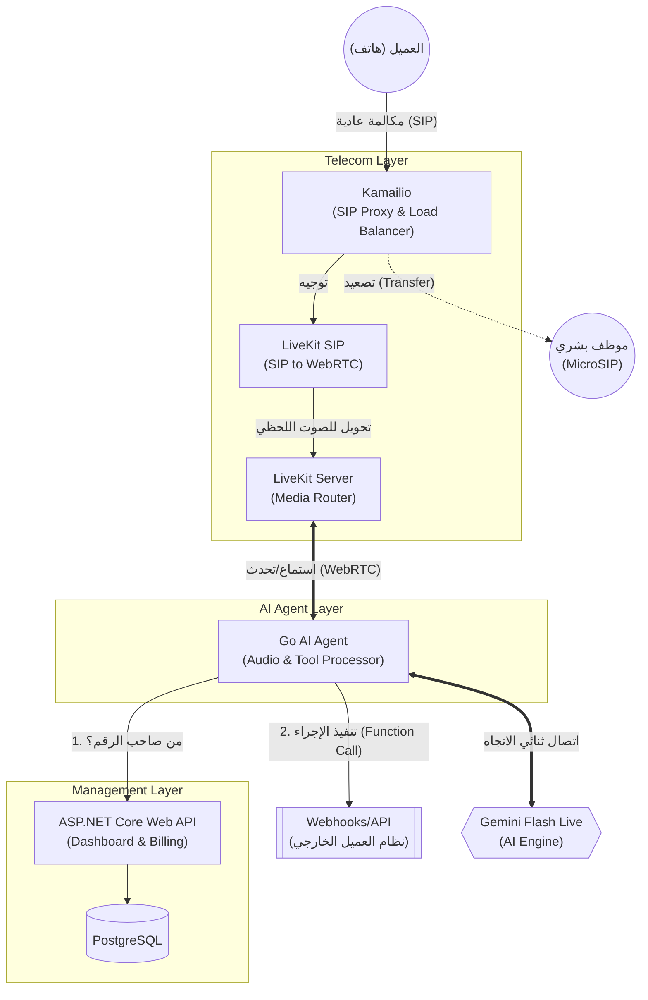

# Omni-Industry Voice AI CPaaS - Master Blueprint 🚀

هذا المستند الشامل (Whitepaper) يمثل المرجع الهندسي والتجاري لبناء منصة اتصالات سحابية بالذكاء الاصطناعي (Voice AI as a Service) بأسس تقنية جاهزة للتوسع لتقييم +100 مليون دولار.

---

## 1. الرؤية العامة (The Vision)
بناء بنية تحتية (Infrastructure) لا تعتمد على الـ STT أو الـ TTS التقليدي، بل تعتمد على النماذج التوليدية الحية (Multimodal Live Models) لإنشاء وكلاء ذكاء اصطناعي (AI Agents) قادرين على إجراء مكالمات هاتفية في الوقت الفعلي (Real-Time) بدون أي تأخير، مع قدرة فائقة على فهم المشاعر وتنفيذ الأوامر.

المنصة مصممة لتكون **(Agnostic)**، أي تدعم قطاعين رئيسيين:
1. **القطاع العادي (Non-SaaS):** مطاعم، عيادات، عقارات، متاجر (بناء على Base Knowledge بسيطة).
2. **قطاع الـ (B2B SaaS):** منصات تقنية، أنظمة ERP، خدمات سحابية (تتطلب تكامل عميق عبر Webhooks للقيام بالدعم الفني المتقدم).

---

## 2. حزمة التكنولوجيا (The Tech Stack)

استخدمنا سياسة **(Polyglot Microservices)** لاختيار أفضل تقنية لكل مهمة:

### أ) طبقة الاتصالات والشبكات (Telecom Edge Layer)
* **Kamailio:** موازن حمل (SIP Load Balancer) جبار لاستقبال وتوزيع آلاف الاتصالات الهاتفية الواردة من مزود الخدمة.
* **Asterisk / LiveKit SIP:** جسر العبور (Bridge) لتحويل مكالمات الـ SIP التقليدية إلى مسارات (WebRTC) حديثة.
* **LiveKit Server:** خادم البث الفعلي (WebRTC SFU) لضمان أعلى نقاء للصوت وأقل نسبة فقدان للبيانات (Ultra-Low Latency).

### ب) طبقة المعالجة اللحظية (Data Plane / AI Engine)
* **Golang (Go):** لغة برمجة عملاء الذكاء الاصطناعي (Go Agents). تمتاز بالـ Goroutines لإدارة عشرات الآلاف من الاتصالات المتزامنة (WebSockets) بخفة وسرعة.
* **Gemini Flash Live API:** محرك الذكاء الاصطناعي (Multimodal Live Model) للقيام بالاستماع والتحدث في نفس اللحظة عبر الـ WebSockets.

### ج) طبقة التحكم والإدارة (Control Plane)
* **ASP.NET Core:** العقل المدبر لإنشاء لوحة التحكم، واجهات الـ API للعملاء، إدارة المشتركين (Tenants)، إعداد الـ Prompts، ومعالجة الفواتير والتسعير.
* **PostgreSQL:** قاعدة البيانات العلائقية الرئيسية.

### د) البنية التحتية والاستضافة (Infrastructure)
* **Kubernetes (K8s):** الأوركسترا التي تدير تشغيل كل هذه التطبيقات وتوسعتها أفقياً (Auto-scaling) لضمان Uptime بنسبة 99.99%.

---

## 3. المعمارية الهندسية (Architecture Diagram)

---

## 4. الميزات التنافسية الخارقة (Killer Features)

1. **انعدام التأخير (Zero-Latency Conversational AI):** استجابة بشرية طبيعية لا تتجاوز 800ms، مع إمكانية مقاطعة البوت أثناء كلامه بكل سلاسة (Natural Interruptions).
2. **استدعاء الدوال الحية (Live Function Calling):** لا يكتفي البوت بالكلام، بل يقوم بأفعال. إذا طلب العميل تأجيل موعد، يقوم الـ Go Agent بإيقاف الصوت للحظة، استدعاء الـ API الخاص بنظام العميل، ثم يخبر العميل: "تم تأجيل موعدك للغد بنجاح".
3. **التسليم البشري بذكاء (Human Handoff via MicroSIP):** إذا غضب المتصل، يقوم البوت فوراً بتحويل المكالمة رقمياً إلى برنامج (MicroSIP) الخاص بالدعم الفني للعميل، مع إرسال إشعار على الشاشة (Screen Pop) يحتوي على ملخص ما قاله العميل للبوت.
4. **أرقام مخصصة (BYOC - Bring Your Own Carrier):** يمكن لأي عميل ربط أرقام الهواتف الخاصة بشركته بالمنصة فوراً عبر SIP Trunk.
5. **الوعي بالسياق (State Awareness):** البوت قادر على جلب سجلات المستخدم قبل بدء المكالمة (مثال: "أرى أن بطاقتك الائتمانية رُفضت بالأمس، هل تتصل بخصوص هذا؟").

---

## 5. تجربة المطورين وحزم الربط (Developer Experience & SDKs)

المنصة لا تعتمد فقط على الـ Webhooks، بل تقدم بيئة تطوير متكاملة (Ecosystem) لجذب المطورين والشركات، من خلال توفير نوعين من حزم التطوير (SDKs):

### أ) حزم الواجهات الأمامية (Frontend WebRTC SDKs)
* **اللغات المدعومة:** React, Vue, Flutter, iOS (Swift), Android (Kotlin).
* **الوظيفة:** تُمكن هذه الحزم عملاء الـ SaaS من دمج زر "اتصل بالذكاء الاصطناعي" داخل تطبيقات الموبايل أو مواقع الويب الخاصة بهم.
* **التقنية المستخدمة:** غلاف (Wrapper) مبني فوق حزم **LiveKit** الأصلية، مما يسمح للمستخدم بفتح المايكروفون والتحدث مع البوت مباشرة عبر الإنترنت دون الحاجة لشبكة الهواتف التقليدية (PSTN).
* **الأمان:** تعتمد على رموز مؤقتة (Temporary Tokens) لا تسمح إلا بإجراء مكالمة واحدة فقط.

### ب) حزم الإدارة الخلفية (Backend Management SDKs)
* **اللغات المدعومة:** Node.js, Python, Java, C#, Go, PHP.
* **الوظيفة:** تُمكن سيرفرات العملاء من التحكم برمجياً في حساباتهم على منصتك (مثال: إنشاء بوت جديد، رفع ملفات معرفة Knowledge Base، أو إطلاق مكالمات صادرة Outbound Calls).
* **التقنية المستخدمة:** الكود المصدري لهذه الحزم يتم إنشاؤه أوتوماتيكياً بالكامل (Write Once, Generate Everywhere) باستخدام أدوات مثل **OpenAPI Generator** أو **Kiota** بناءً على مواصفات الـ API الخاصة بـ ASP.NET Core، مما يوفر آلاف ساعات البرمجة ويضمن توافقية تامة مع كل لغات البرمجة.
* **الأمان:** تتطلب مفتاح أمان سري (Secret API Key) ولا تُستخدم إلا في السيرفرات الآمنة.

---

## 6. نموذج العمل والطريق نحو تقييم 100 مليون دولار (Go-to-Market Strategy)

للوصول إلى مرحلة النمو الفائق (Hyper-Growth) في أقل من عام:

* **استراتيجية B2B2B (White-labeling):**
  التركيز على بيع الخدمة كـ API لمنصات الـ SaaS الكبرى (مثل Odoo, FoodRMS, Shopify partners). هذه المنصات ستقوم بإعادة بيع "البوت الصوتي" لعملائها، مما يجلب آلاف المشتركين دفعة واحدة دون الحاجة لتسويق فردي مكلف.
  
* **نموذج الإيرادات (Monetization):**
  1. **الاشتراكات الثابتة (Tiered Subscriptions):** لدعم الاحتفاظ بالعملاء (Retention) لتوفير خدمات الـ (Human Handoff) و الـ (Deep Webhooks).
  2. **الدفع بالاستهلاك (Pay-As-You-Go):** تسعير ثابت للدقيقة يشمل رسوم الـ API لـ Gemini + تكاليف استضافة الـ LiveKit. (هامش الربح عالي جداً لعدم وجود وسيط مثل Twilio).

* **عامل الجذب للمستثمرين (The Moat):**
  بناء البنية التحتية الخاصة للاتصالات (Kamailio + LiveKit + Asterisk) يعطي الشركة استقلالية تامة، ويجعل المستثمرين يقيّمون الشركة كـ "مزوّد بنية تحتية تقنية" (Infrastructure Provider) وليس مجرد "تطبيق"، مما يرفع مضاعف التقييم المالي (Valuation Multiple) لأرقام قياسية.
=================

Viewed generate.sh:1-18

بناءً على الهندسة المعمارية (Architecture) والمخطط الشامل (PRD) الذي قمنا بتصميمه، المنصة ليست مجرد "تطبيق ذكاء اصطناعي"، بل هي **بنية تحتية لاتصالات سحابية (Voice AI CPaaS)**. 

إليك تفصيل شامل للمميزات ونماذج العمل (ناقشني إن أردت التعمق في أي نقطة):

---

### أولاً: المميزات الخارقة للمنصة (Platform Killer Features)

1. **محادثة لحظية بانعدام التأخير (Zero-Latency Conversational AI):**
   تجاوزنا تقنيات (تحويل الصوت لنص ثم لنص لصوت STT/TTS) البطيئة. البوت يسمع ويتحدث في نفس اللحظة عبر (WebRTC + Gemini Flash Live) بتأخير لا يتجاوز 800 جزء من الثانية، مع إمكانية مقاطعة العميل للبوت أثناء كلامه بسلاسة تامة.

2. **القيام بأفعال حقيقية أثناء المكالمة (Live Function Calling):**
   البوت لا يتحدث فقط، بل يتخذ قرارات. إذا اتصل عميل لتغيير موعد، يقوم البوت بإيقاف صوته للحظة، يستدعي الـ API الخاص بنظام العيادة (Webhooks)، يعدل الموعد، ثم يقول للعميل: "تم تعديل موعدك بنجاح".

3. **التصعيد الذكي للعنصر البشري (Smart Human Handoff):**
   إذا غضب العميل أو سأل سؤالاً معقداً، يقوم البوت فوراً بتحويل المكالمة إلى هاتف موظف الدعم البشري (عبر SIP)، وتظهر للموظف شاشة (Screen Pop) فورية على جهازه تلخص كل ما قاله العميل للبوت لتوفير وقت الإعادة.

4. **إحضار الأرقام الخاصة بالعميل (BYOC - Bring Your Own Carrier):**
   لن نُجبر الشركات على شراء أرقام من عندنا. يمكن لأي شركة ربط أرقام هواتفها الحالية بخوادمنا فوراً باستخدام (SIP Trunk).

5. **الوعي المسبق بالسياق (State Awareness):**
   قبل أن يرد البوت على الاتصال، يتصل بنظام العميل ليجلب معلومات المتصل ويبادره بها (مثلاً: *"أهلاً أستاذ أحمد، أرى أن طلبك تأخر بالأمس، هل تتصل بخصوص ذلك؟"*).

6. **الوصول الشامل (Omnichannel):**
   يمكن الاتصال بالبوت عبر شبكات الهاتف العادية، أو من خلال زر "اتصل بنا" مجاني داخل المواقع وتطبيقات الموبايل عبر حزم (Frontend SDKs) التي أسسناها.

---

### ثانياً: نماذج العمل وطرق تحقيق الأرباح (Business Models & Monetization)

المنصة مصممة لتكون قابلة للتوسع بشكل هائل (Hyper-growth)، وتدعم 4 نماذج عمل رئيسية:

**1. نموذج B2B2B (White-labeling) - المحرك الأساسي للنمو:**
   * **كيف يعمل؟** بدلاً من بيع الخدمة لمطعم أو عيادة واحدة، سنبيع الخدمة كـ (API/SDK) لمنصات SaaS الكبرى (مثل Odoo, Foodics, Shopify).
   * **الميزة:** ستقوم هذه المنصات بإعادة بيع "البوت الصوتي" لآلاف العملاء لديها تحت علامتها التجارية. هذا سيجلب آلاف المشتركين دفعة واحدة بدون أي تكلفة تسويقية (Zero CAC).

**2. الدفع بالاستهلاك (Pay-As-You-Go):**
   * **كيف يعمل؟** تسعير الخدمة "بالدقيقة".
   * **الميزة:** لأننا بنينا البنية التحتية للاتصالات بأنفسنا (Kamailio, Asterisk, LiveKit) ولم نعتمد على وسيط غالي مثل Twilio، ستكون تكلفة الدقيقة علينا قروشاً بسيطة، مما يسمح بوضع هامش ربح (Profit Margin) ضخم جداً.

**3. الاشتراكات الشهرية الثابتة (Tiered SaaS Subscriptions):**
   * **كيف يعمل؟** باقات شهرية (Starter, Pro, Enterprise).
   * **الميزة:** الباقات تفتح ميزات متقدمة. مثلاً، ميزة "التصعيد للعنصر البشري" أو "الربط مع Webhooks متقدمة" تتطلب اشتراكاً شهرياً ثابتاً. هذا يضمن إيرادات متكررة مستقرة (MRR).

**4. النشر المؤسسي المغلق (Enterprise On-Prem / VPC):**
   * **كيف يعمل؟** بناءً على استخدامنا لـ `Kubernetes` و `Docker`، يمكننا أخذ نسخة كاملة من المنصة وزرعها في سيرفرات خاصة بالبنوك أو المستشفيات الحكومية التي تمنع خروج بياناتها لسحابة عامة.
   * **الميزة:** صفقات مالية ضخمة جداً (High-Ticket Sales) تُدفع كرسوم ترخيص سنوية وعقود صيانة.

---

هل ترى أن هناك نموذج عمل معين (مثل B2B2B) ترغب في أن نركز عليه أكثر عند تصميم لوحة تحكم الـ (Admin Panel)؟

=====================

بكل تأكيد! هذه المنصة بمرونتها يمكن أن تخدم تقريباً أي قطاع أعمال في السوق. 

إليك قائمة موسعة بـ **20 قطاع أعمال مباشر** (للعملاء النهائيين)، و **20 نوع من منصات SaaS** (كشركاء White-label) يمكنك استهدافها:

---

### 🚀 أولاً: 20 قطاع أعمال مباشر (العملاء النهائيون End-Users)

1. **المتاجر الإلكترونية (E-Commerce):** تأكيد طلبات الدفع عند الاستلام (COD)، وتتبع الشحنات.
2. **العيادات والمراكز الطبية:** حجز المواعيد، الإلغاء، والتذكير لتقليل التخلف عن الحضور (No-shows).
3. **المطاعم والكافيهات:** استلام الطلبات الخارجية (Delivery)، وحجز الطاولات، وعرض المنيو صوتياً.
4. **المكاتب العقارية:** الرد على الإعلانات، تقييم قدرة العميل المالية (Lead Qualification)، وتحديد أوقات المعاينة.
5. **الفنادق وقطاع الضيافة:** الاستقبال الآلي لخدمة الغرف، طلبات النظافة، والاستعلام عن المرافق.
6. **شركات الشحن والخدمات اللوجستية:** تنسيق مواعيد التوصيل، وإبلاغ العميل بمكان المندوب.
7. **مراكز صيانة السيارات:** حجز مواعيد الفحص الدوري، وإرسال تنبيهات صوتية عند جاهزية السيارة.
8. **صالونات التجميل والسبا:** جدولة الجلسات، وعرض الباقات المتاحة، وتقديم خصومات للأعضاء.
9. **شركات التنظيف والخدمات المنزلية:** طلب خدمة طارئة (سباكة/كهرباء)، ومعرفة أسعار الخدمات المترية.
10. **شركات السفر والسياحة:** الإجابة عن متطلبات التأشيرات (الفيزا)، حالة الطيران، وحجوزات التذاكر.
11. **شركات التأمين:** متابعة حالة المطالبات (Claims)، وتقديم معلومات سريعة عن التغطيات البوليصية.
12. **المدارس والمراكز التعليمية:** الإجابة عن شروط القبول، الرسوم الدراسية، وتنبيه أولياء الأمور بغياب الطلاب.
13. **صالات الألعاب الرياضية (Gyms):** الاستفسار عن الاشتراكات، حجز حصص تدريبية (Classes)، وتجميد الاشتراكات.
14. **عيادات الطب البيطري:** حجز مواعيد التطعيم للحيوانات، والمتابعة الهاتفية بعد العمليات الجراحية.
15. **تنظيم الفعاليات والمؤتمرات:** شراء التذاكر صوتياً، الاستعلام عن مواقع الفعاليات وأوقاتها.
16. **مكاتب المحاماة:** أخذ بيانات العميل الأولية وتصنيف نوع القضية (جنائي، أحوال شخصية) قبل تحويله للمحامي.
17. **وكالات تأجير السيارات:** تمديد فترة الإيجار هاتفياً، الإبلاغ عن الحوادث، أو الاستعلام عن توفر سيارة معينة.
18. **الجمعيات الخيرية والمنظمات غير الربحية:** حملات التبرع الهاتفية الآلية (Outbound)، والرد على استفسارات الكفالات.
19. **شركات الاتصالات ومزودي الإنترنت:** الدعم الفني المبدئي (إعادة تشغيل الراوتر)، وتذكيرات سداد الفواتير.
20. **البنوك وشركات التمويل:** الاستعلام عن الرصيد، تجميد البطاقات المفقودة، والاستعلام عن حالة طلب القرض.

---

### 🌐 ثانياً: 20 نوع من منصات SaaS (شركاء B2B2B / White-label)
*(هذه المنصات ستقوم بشراء الخدمة منك وإضافتها كـ Plugin لعملائها)*

1. **أنظمة إدارة المطاعم (Restaurant POS):** (مثل Foodics). إضافة ميزة "الرد الآلي على الطلبات".
2. **منصات التجارة الإلكترونية:** (مثل Shopify, Salla). إضافة تطبيق لتأكيد الشحنات واسترجاع العربات المتروكة صوتياً.
3. **أنظمة إدارة العيادات (Clinic EHR):** (مثل Nymbl). توفير "سكرتير طبي افتراضي" متصل بجدول مواعيد الأطباء.
4. **منصات إدارة خدمة العملاء (Helpdesk):** (مثل Zendesk). فتح قناة صوتية جديدة تُنشئ "تذاكر دعم" تلقائياً بعد المكالمة.
5. **أنظمة إدارة علاقات العملاء (CRM):** (مثل Salesforce, HubSpot). تسجيل ملخص المكالمات الهاتفية وتحليل مشاعر العميل داخل النظام.
6. **برامج الحجوزات والمواعيد (Scheduling SaaS):** (مثل Calendly, Fresha). تمكين حجز المواعيد عبر الاتصال الهاتفي بدلاً من الروابط.
7. **أنظمة إدارة العقارات (Property Management):** (مثل Buildium). استقبال شكاوى الصيانة من المستأجرين في أي وقت وإضافتها لنظام الصيانة.
8. **أنظمة تخطيط الموارد (ERP):** (مثل Odoo, SAP). أتمتة العمليات الداخلية (موظف يتصل ليطلب إجازة ويتم تسجيلها في النظام).
9. **أنظمة إدارة الفنادق (Hotel PMS):** (مثل Cloudbeds). ربط البوت بهواتف الغرف لطلبات النزلاء مباشرة.
10. **منصات التوظيف (ATS / HR SaaS):** (مثل Workable). عمل "مقابلات تصفية هاتفية" (Phone Screening) لآلاف المتقدمين ورفع تقييم لكل مرشح.
11. **برامج المحاسبة السحابية:** (مثل Xero, QuickBooks). إطلاق حملات اتصال آلية للعملاء المتعثرين لتذكيرهم بسداد الفواتير.
12. **منصات إدارة التعليم (EdTech / LMS):** (مثل Canvas). الاتصال بالطلاب لتذكيرهم بمواعيد تسليم المشاريع أو الاختبارات.
13. **أنظمة إدارة الصالات الرياضية (Gym SaaS):** (مثل Mindbody). الرد على الاستفسارات خارج أوقات العمل وتذكير الأعضاء بتجديد الاشتراك.
14. **برامج إدارة الأسطول والشحن (Fleet Management):** (مثل Onfleet). تواصل البوت مع السائقين لتحديث حالات التوصيل بالصوت أثناء القيادة.
15. **منصات إدارة الفعاليات (Event SaaS):** (مثل Eventbrite). بوت مخصص للإجابة عن أسئلة الزوار حول موقع الفعالية وأوقات العمل.
16. **أنظمة إدارة مكاتب المحاماة (Legal SaaS):** (مثل Clio). أتمتة استقبال العملاء الجدد (Client Intake) وتصنيفهم قانونياً.
17. **منصات الحجوزات السياحية (Travel SaaS):** (مثل FareHarbor). الرد الآلي على السائحين لتأكيد حجوزات الجولات وتعديل الأوقات.
18. **منصات جمع التبرعات (Fundraising SaaS):** (مثل Blackbaud). توجيه رسائل صوتية مخصصة للمتبرعين في المواسم (مثل رمضان).
19. **برامج التسويق الآلي (Marketing Automation):** (مثل ActiveCampaign). دمج "المكالمة الصوتية" كجزء من رحلة العميل (مثلاً إذا لم يفتح الإيميل، يتم الاتصال به).
20. **منصات تأجير المعدات والسيارات:** (مثل Rentall). بوت للتعامل مع طلبات الطوارئ والمساعدة على الطريق (Roadside Assistance) على مدار الساعة.

---
