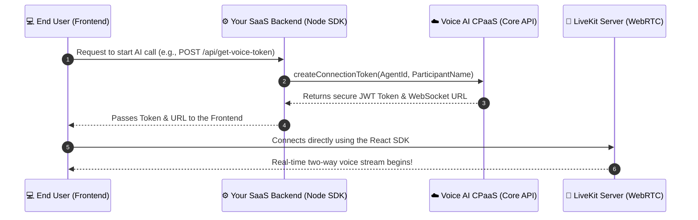

# @solo3li/backend-node

The official Node.js Server SDK for the **Voice AI CPaaS**. 
This library allows SaaS backends to securely authenticate with the CPaaS API and generate short-lived LiveKit access tokens for their front-end users. It acts as a bridge between your application and the AI voice infrastructure.

## 🏗 Architecture & Flow



## 📦 Installation

Install the package via npm:

```bash
npm install @solo3li/backend-node
```

Or via yarn:

```bash
yarn add @solo3li/backend-node
```

## 🔒 Security Warning

This SDK must **ONLY** be used on your secure backend server (e.g., Node.js, Express, NestJS). Never expose your `apiKey` in a client-side application (React, Angular, iOS, etc.), as it gives full access to your CPaaS account.

---

## 🚀 Quick Start & Usage

### 1. Initialize the Client

First, import the `CPaaSClient` and initialize it with your Secret API Key. This key is used to authenticate requests to the CPaaS Core API.

```typescript
import { CPaaSClient } from '@solo3li/backend-node';

// Initialize the client with your secret API Key
const cpaas = new CPaaSClient({
    apiKey: 'sk_1234567890abcdef...', // Required: Your Secret API Key
    baseUrl: 'https://api.yourcpaas.com' // Optional: Custom CPaaS URL (defaults to production)
});
```

### 2. Generate a Connection Token (Express.js Example)

When a user on your frontend wants to start a voice call, your frontend should make a REST API request to your backend. Your backend then uses this SDK to generate a secure, short-lived token.

```typescript
import express from 'express';
import { CPaaSClient } from '@solo3li/backend-node';

const app = express();
app.use(express.json());

const cpaas = new CPaaSClient({ apiKey: process.env.CPAAS_API_KEY });

app.post('/api/get-voice-token', async (req, res) => {
    try {
        // 1. Get user details from the request
        const { participantName } = req.body;

        // 2. Request a token from the CPaaS
        const connection = await cpaas.createConnectionToken({
            agentId: '550e8400-e29b-41d4-a716-446655440000', // The ID of the Agent from your Dashboard
            participantName: participantName || 'Guest User', // Name of the end-user
            metadata: {
                'Context': 'SaaS Customer Support',
                'Language': 'Arabic'
            }
        });

        // 3. Send the token and URL back to your Frontend
        res.json({
            token: connection.token,
            livekitUrl: connection.livekitUrl,
            roomId: connection.roomName // Useful for Human Agent transfers
        });

    } catch (error) {
        console.error('Failed to generate CPaaS token:', error);
        res.status(500).json({ error: 'Failed to connect to AI' });
    }
});

app.listen(4000, () => console.log('Server running on port 4000'));
```

### 3. Generate a Transfer Token for Human Agents

If you have a Dashboard where human agents can take over calls, you can generate a token that allows them to join a specific active room.

```typescript
app.post('/api/get-transfer-token', async (req, res) => {
    try {
        const { roomId, agentName } = req.body;
        
        if (!roomId) {
            return res.status(400).json({ error: 'roomId is required' });
        }
        
        // Generate a token for the human agent to join the specific room
        const connection = await cpaas.getTransferToken({
            roomId: roomId,
            participantName: agentName || 'Human Agent'
        });

        res.json(connection);
    } catch (error) {
        res.status(500).json({ error: 'Failed to generate transfer token' });
    }
});
```

---

## 🛠 API Reference

### `CPaaSClient` Options

| Property  | Type     | Required | Description                                      |
| --------- | -------- | -------- | ------------------------------------------------ |
| `apiKey`  | `string` | Yes      | Your private API key for authentication.         |
| `baseUrl` | `string` | No       | The base URL of the CPaaS API.                   |

### `createConnectionToken(params)`

Generates a new room and returns a token for the user to connect to an AI agent.

**Parameters:**
- `agentId` (string) - Required. The UUID of the AI agent configuration to use.
- `participantName` (string) - Required. The display name of the user joining the call.
- `metadata` (object) - Optional. Key-value pairs to pass context to the AI's prompt.

**Returns:**
An object containing:
- `token` (string): The LiveKit JWT token.
- `roomName` (string): The unique ID of the generated room.
- `livekitUrl` (string): The WebSocket URL for LiveKit.

### `getTransferToken(params)`

Generates a token to join an *existing* room (useful for human agent handoff).

**Parameters:**
- `roomId` (string) - Required. The ID of the room to join (returned by `createConnectionToken`).
- `participantName` (string) - Required. The display name of the human agent joining.

**Returns:**
An object containing `token`, `roomName`, and `livekitUrl`.

## License
MIT
