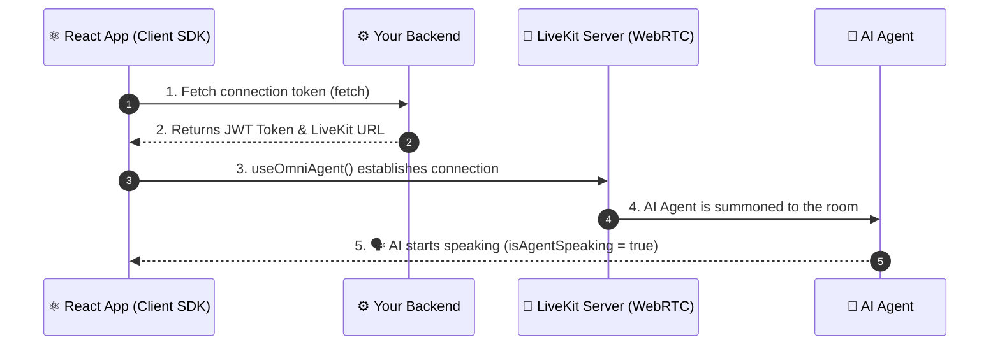

# @solo3li/client-react

The official React SDK for connecting your web applications to the **Voice AI CPaaS**. 
This library provides seamless React Hooks (`useOmniAgent` and `useHumanAgent`) to handle WebRTC connections, audio routing, state management, and human-handoff for your AI Voice Agents.

## 🏗 Workflow & Integration



## 📦 Installation

```bash
npm install @solo3li/client-react
```

*Note: This package requires `react` and `livekit-client` as peer dependencies.*

---

## 🚀 Features

- **Auto Audio Routing:** Automatically attaches remote audio tracks to the DOM so you don't have to manage `<audio>` elements manually.
- **Active Speaker Detection:** Easily bind UI animations to the `isAgentSpeaking` state.
- **Microphone Management:** Automatically requests microphone permissions and publishes the local audio track upon connection.
- **Human Handoff:** Includes tools for human agents to join rooms and take over calls.

---

## 📖 Hook 1: `useOmniAgent` (For the Customer View)

This hook is used on the customer-facing side of your application where the user talks to the AI Agent.

### 1. Fetching the Token
Before using the hook, your React app must fetch a connection token from your backend server (which uses `@solo3li/backend-node`).

### 2. Using the Hook

```tsx
import React, { useState } from 'react';
import { useOmniAgent } from '@solo3li/client-react';

export const CustomerCallScreen: React.FC = () => {
    const [token, setToken] = useState('');
    const [url, setUrl] = useState('');

    // Fetch token from your backend
    const startCall = async () => {
        const response = await fetch('/api/get-voice-token', {
            method: 'POST',
            headers: { 'Content-Type': 'application/json' },
            body: JSON.stringify({ participantName: 'Ahmed' })
        });
        const data = await response.json();
        setToken(data.token);
        setUrl(data.livekitUrl);
    };

    // Initialize the AI Agent Hook
    const { isConnected, isAgentSpeaking, disconnect } = useOmniAgent({
        token,
        livekitUrl: url,
        onAgentConnected: () => console.log('AI Agent joined the room!'),
        onAgentDisconnected: () => console.log('AI Agent left the room.'),
    });

    return (
        <div style={{ textAlign: 'center', padding: '50px' }}>
            <h2>Voice AI Assistant</h2>
            
            {!isConnected ? (
                <button onClick={startCall}>Start AI Call</button>
            ) : (
                <>
                    <p>Status: 🟢 Connected</p>
                    <div style={{ margin: '20px', fontSize: '24px' }}>
                        {isAgentSpeaking ? '🗣️ Agent is speaking...' : '👂 Agent is listening...'}
                    </div>
                    <button onClick={disconnect} style={{ color: 'red' }}>End Call</button>
                </>
            )}
        </div>
    );
};
```

---

## 📖 Hook 2: `useHumanAgent` (For the Employee Dashboard)

This hook is used in your internal Employee/Agent Dashboard. When the AI escalates a call, the human agent can input the `roomId` and join the conversation.

### Using the Hook

```tsx
import React, { useState } from 'react';
import { useHumanAgent } from '@solo3li/client-react';

export const AgentDashboard: React.FC = () => {
    const [roomId, setRoomId] = useState('');
    const [token, setToken] = useState('');
    const [url, setUrl] = useState('');

    // Fetch a transfer token from your backend
    const joinCall = async () => {
        const response = await fetch('/api/get-transfer-token', {
            method: 'POST',
            headers: { 'Content-Type': 'application/json' },
            body: JSON.stringify({ roomId, agentName: 'Support Agent' })
        });
        const data = await response.json();
        setToken(data.token);
        setUrl(data.livekitUrl);
    };

    // Initialize the Human Agent Hook
    const { isConnected, participants, disconnect } = useHumanAgent({
        token,
        livekitUrl: url
    });

    return (
        <div style={{ padding: '20px', border: '1px solid #ccc' }}>
            <h2>📞 Employee Agent Dashboard</h2>
            
            {!isConnected ? (
                <div>
                    <input 
                        type="text" 
                        placeholder="Enter Room ID" 
                        value={roomId} 
                        onChange={e => setRoomId(e.target.value)} 
                    />
                    <button onClick={joinCall}>Join Call</button>
                </div>
            ) : (
                <div>
                    <p>🟢 Live in Room: {roomId}</p>
                    
                    <h3>Participants in Call:</h3>
                    <ul>
                        {participants.map(p => (
                            <li key={p.sid}>
                                {p.identity} {p.isSpeaking ? '🔊 (Speaking)' : ''}
                            </li>
                        ))}
                    </ul>

                    <button onClick={disconnect} style={{ color: 'red' }}>Leave Call</button>
                </div>
            )}
        </div>
    );
};
```

---

## 🛠 API Reference

### `useOmniAgent(params)`

**Parameters:**
- `token` (string) - The JWT token for connection.
- `livekitUrl` (string) - The WebSocket URL for LiveKit.
- `onAgentConnected` (function) - Callback when the remote AI agent connects.
- `onAgentDisconnected` (function) - Callback when the remote AI agent disconnects.

**Returns:**
- `isConnected` (boolean) - Whether the local user is connected to the room.
- `isAgentSpeaking` (boolean) - Whether the remote AI agent is currently speaking.
- `disconnect` (function) - Call this to end the call and leave the room.

### `useHumanAgent(params)`

**Parameters:**
- `token` (string) - The JWT token for connection.
- `livekitUrl` (string) - The WebSocket URL for LiveKit.

**Returns:**
- `isConnected` (boolean) - Whether the human agent is connected to the room.
- `participants` (array) - List of all participants in the room, including their `identity`, `sid`, and `isSpeaking` state.
- `disconnect` (function) - Call this to end the call and leave the room.

## License
MIT
